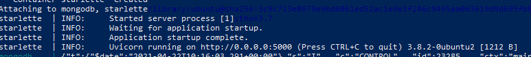

# Food Recommendation System

Food Recommendation System built using [Starlette](https://www.starlette.io/) and [Mongodb](https://www.mongodb.com/) and containerized using [Docker](https://www.docker.com/).
## Dependencies

- python 3.7
- mongodb 4.4
- docker 20.10.5
- docker-compose 1.28.6
  
## Dataset

This Project was built using the [Food.com Recipes and Interactions](https://www.kaggle.com/shuyangli94/food-com-recipes-and-user-interactions/code) dataset from Kaggle.

## Directory Structure

- FRS
  - app  *Starlette app directory*
    - app.py    *Application file*
    - middleware.py *Middleware used to connect to the database*
    - routes.py *Route handling*
    - Dockerfile *Dockerfile to build the starlette app*
    - static *static content to serve at the front-end*
    - templates *HTML files to serve at the front-end*
  - mongodb  *Mongodb database directory*
  - docker-compose.yml  *docker-compose file to spin-up the multi-container application*

## Steps to launch the application

- [Install git](https://git-scm.com/book/en/v2/Getting-Started-Installing-Git)

### For Windows 10
 
- [Download and Install Docker Desktop](https://www.docker.com/products/docker-desktop)

#### Open a Powershell(Admin) for the following steps
- Update to WSL2.
*Note*: To update to WSL 2, you must be running Windows 10.
        
  * Copy and paste the following commands in a Powershell(Admin) window:
  
        dism.exe /online /enable-feature /featurename:Microsoft-Windows-Subsystem-Linux /all /norestart

        dism.exe /online /enable-feature /featurename:VirtualMachinePlatform /all /norestart
      
  * Download the [WSL Linux Kernel Update Package](https://wslstorestorage.blob.core.windows.net/wslblob/wsl_update_x64.msi) and run the downloaded file. The installation is pretty straightforward.
  
  * Change default version to WSL2. Copy and paste the following command in a Powershell(Admin) window:
  
        wsl --set-default-version 2
      
  * Restart your machine
     
*Note*: You can refer the following [link](https://docs.microsoft.com/en-us/windows/wsl/install-win10) if you face any issues in the above step.

#### Open a git bash for the following steps
- Clone the repo. Paste the following commands in the terminal:
      
      git lfs install --skip-smudge
      
      git clone https://github.com/mukesh-jv/FRS
      
- Move to Working Directory:

      cd FRS
     
- Download Large Files using Git LFS:
        
      git lfs pull

#### Open a Poweshell(admin) for the following steps

- cd into the FRS directory

- Spin up the containers using docker-compose

      docker compose up
      
     This step takes some time. When the containers are ready you can see the following in the log:
     
     
     
   *Note*: If you face any errors in this step, please consider restarting Docker or your machine and repeat the above step. Paste the following command in your terminal to restart docker:

      restart-service *docker*
      
    [Optional]You can also use the following command to run the containers in detached mode.
        
      docker compose up -d

- Open the application in browser at the following url:

      localhost:5000

- Close the application - You can use ctrl+c to stop the application. 

     Paste the following command in terminal to remove the containers.

      docker compose down
 
 ### For Linux-based OS
 
- [Install Docker Engine](https://docs.docker.com/engine/install/)

- [Install Docker Compose](https://docs.docker.com/compose/install/)

- [Install Git LFS](https://git-lfs.github.com/)
  
#### Open a terminal for the following steps

- Clone the repo
  
        git lfs install --skip-smudge
        
        git clone https://github.com/mukesh-jv/FRS

- Move to working directory

        cd FRS
        
- Download Large Files using Git LFS
        
        git lfs pull

- Spin up the containers using docker-compose

        sudo docker-compose up

     This step takes some time. When the containers are ready you can see the following in the log:
     
     
     
     
     [Optional]You can also use the following command to run the containers in detached mode.
        
       sudo docker-compose up -d
       
- Open the application in the browser at the following url:

        localhost:5000

- Close the application - You can use ctrl+c to stop the application. 

   Paste the following command in your terminal to remove the containers.

      sudo docker-compose down
      
*Note*: Images for the suggested recipes are fetched using the Google Search API. The currently used free version serves only 100 requests per day.

